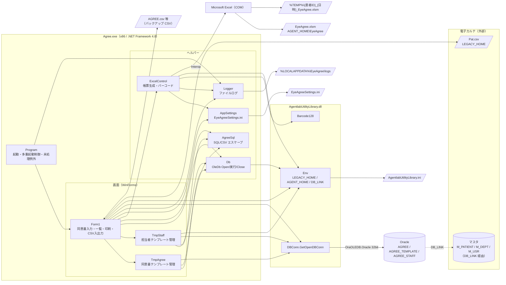
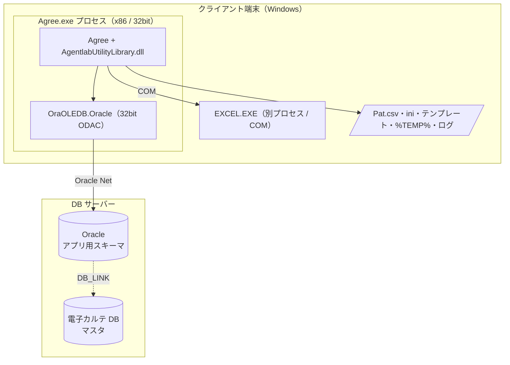

# システム構成・依存関係

眼科同意書アプリ（Agree / EyeAgree）の構成要素と、外部との依存関係をまとめる。
コードは「クラス.メソッド名」で参照する（行番号はすぐ古くなるため使わない）。

## 設計ドキュメント一覧

| ファイル | 内容 |
| --- | --- |
| [architecture.md](architecture.md) | 本書。構成図・依存関係・実行環境・テスト対応 |
| [class_responsibilities.md](class_responsibilities.md) | クラス責務一覧・クラス図 |
| [data_model.md](data_model.md) | ER 図・テーブル定義（コードからの推定） |
| [crud_matrix.md](crud_matrix.md) | 機能 × テーブルの CRUD マトリクス |
| [dataflow.md](dataflow.md) | DFD・シーケンス図・Excel/CSV 入出力マッピング |
| [configuration.md](configuration.md) | 設定ファイル・設定キー一覧 |

処理ステップの詳細な文章説明は既存の [../dataflow.md](../dataflow.md) を参照。

## 1. コンポーネント構成図

## 2. レイヤーと依存の方向

| 層 | 要素 | 依存先 |
| --- | --- | --- |
| エントリ | `Program` | `Form1`, `Logger` |
| 画面 | `Form1`（`Form1.cs` / `Form1.Agree.cs` / `Form1.ImportExport.cs` / `Form1.Designer.cs`）、`TmpAgree`、`TmpStaff` | ヘルパー層、外部 DLL |
| ヘルパー | `Db`、`AgreeSql`、`AppSettings`、`ExcelControl`、`Logger` | 外部 DLL、Excel COM、ファイル |
| 外部 DLL | `AgentlabUtilityLibrary.dll`（`DBConn`, `Env`, `Barcode128`） | `AgentlabUtilityLibrary.ini`、OleDb |
| 外部システム | Oracle、Excel、電子カルテ（Pat.csv / マスタ） | — |

- 業務ロジックと SQL は画面クラス（`Form1` / `TmpAgree` / `TmpStaff`）に直接書かれている。
  リポジトリ層やモデルクラスは無く、画面のコントロール値がそのまま SQL の値になる。
- `TmpAgree` は `Form1` のインスタンスを受け取り、`Form1.applyTemplate` を呼び戻す（双方向の依存）。
- `Db` / `AgreeSql` / `AppSettings` / `Logger` は画面に依存しない。
  このうち `AgreeSql` と `AppSettings` はテストプロジェクトへソースリンクされている。

## 3. 外部ライブラリ・参照

| 参照 | 入手元 | 使用箇所 | 備考 |
| --- | --- | --- | --- |
| `AgentlabUtilityLibrary.dll` | リポジトリ直下（HintPath） | `DBConn.GetOpenDBConn`、`Env.DB_LINK` / `LEGACY_HOME` / `AGENT_HOME`、`Barcode128` | ソースは別リポジトリ。無いとビルド・実行とも不可 |
| `Microsoft.Office.Interop.Excel` | VS ビルド：登録済み Excel の COMReference／`dotnet build`：同梱 PIA | `ExcelControl` | 実行時は Excel のインストールが必要 |
| `System.Data.OleDb` | .NET Framework | `Db`、`Form1`、`TmpAgree`、`TmpStaff` | プロバイダは `OraOLEDB.Oracle`（32bit） |
| `Microsoft.VisualBasic.FileIO.TextFieldParser` | .NET Framework | `Form1.MergeCsvToTable` | CSV インポート |
| `System.Resources.Extensions.dll` | リポジトリ直下 | resx 生成 | CLI ビルド時のみ |

## 4. 実行環境構成

- ビルドは **x86 固定**。32bit プロセスから OleDb を使うため、**32bit 版** `OraOLEDB.Oracle` が必要
  （構築手順：[../oracle_oledb_32bit_setup.md](../oracle_oledb_32bit_setup.md)）。
- Excel は別プロセス（COM）なので、Excel 本体のビット数は問わない。
- 開発・テスト用のローカル Oracle は [../local_oracle_setup.md](../local_oracle_setup.md) を参照。
  テスト用スキーマでは `DB_LINK` を空にして、マスタも同じスキーマに置く。

## 5. 起動と障害時の振る舞い

| 事象 | 振る舞い | 実装 |
| --- | --- | --- |
| 起動 | 30 日より古いログを削除 → 未処理例外ハンドラ登録 → カレントディレクトリを exe の場所へ変更 → 多重起動チェック → `Form1` 表示 | `Program.Main` |
| 多重起動 | 確認ダイアログで OK なら既存プロセスを Kill、キャンセルなら終了 | `Program.Main` |
| DB 接続失敗（起動時の `M_DEPT` 読込） | `Program.OfflineMode = true`。登録・削除・一覧・テンプレート・CSV 入出力を抑止 | `Form1` コンストラクタ |
| UI スレッドの未処理例外 | ログに記録し、日本語メッセージを表示して継続 | `Program.Main` |
| テンプレート未配置 | 探したパスを示すエラーを表示 | `Form1.printAgree` |
| Excel 処理中の例外 | ログに記録して案内を表示。`ExcelControl.Dispose` で COM を解放 | `Form1.printAgree` / `ExcelControl` |
| CSV インポート中の例外 | そのテーブルの取り込みをロールバック（テーブル単位のトランザクション） | `Form1.MergeCsvToTable` |

ログには個人情報（患者 ID・氏名・SQL 全文・入力値）を書かない方針（`Logger` の説明コメント）。

## 6. テストとの対応

詳細な方針は [../test_strategy.md](../test_strategy.md) を参照。

| テスト | 層 | 対象 | 検証内容 |
| --- | --- | --- | --- |
| `AgreeSqlTests`（12 件） | L1 単体 | `AgreeSql.SqlValue` / `CsvEscape` | null/空 → NULL、`'` の二重化、CSV のカンマ・引用符・改行のエスケープ |
| `AppSettingsTests`（3 件） | L1 単体 | `AppSettings.Parse` | 前後空白の除去、コメント・セクション・不正行の無視、重複キーは後勝ち |
| `OracleIntegrationTests`（6 件） | L2 結合 | AGREE / AGREE_TEMPLATE / AGREE_STAFF | 接続、INSERT → SELECT → UPDATE の往復、全列の往復、日本語と `'` の無損失格納 |
| 手動スモーク | L3 | 画面・Excel 帳票 | [../test_strategy.md](../test_strategy.md) §5 のチェックリスト |

自動テストの対象外：`Form1` / `TmpAgree` / `TmpStaff` の画面ロジック、`ExcelControl`（帳票・バーコード）、`Db`、Pat.csv の読込。
