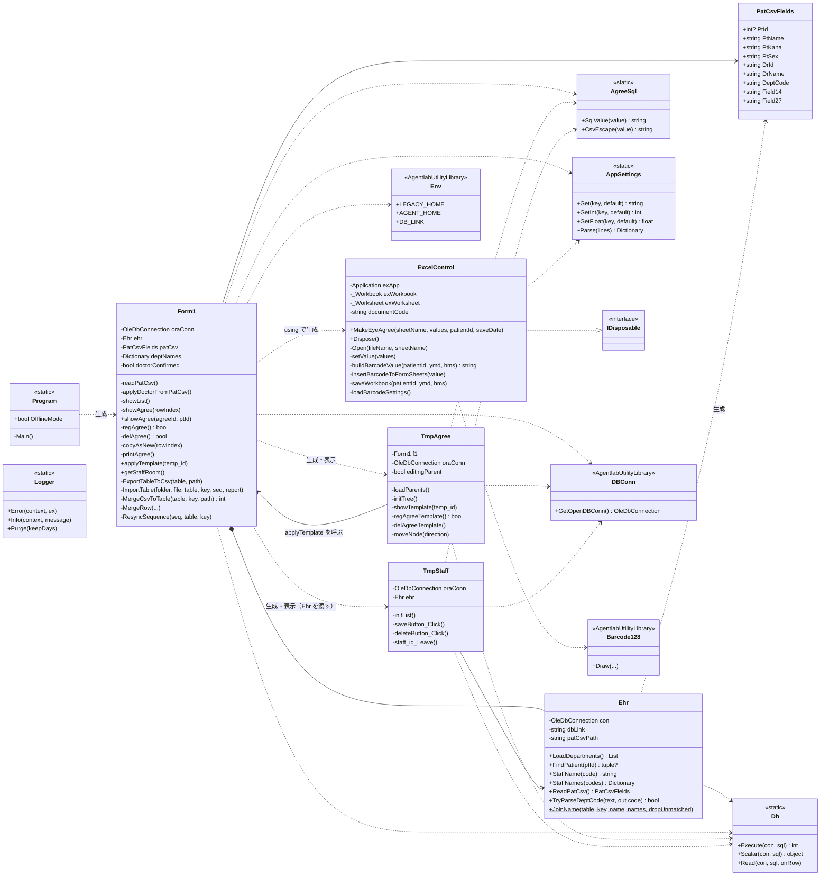

# クラス責務一覧

`Agree/` 配下のクラスの責務と関係をまとめる。`Properties/` と `*.Designer.cs`（画面レイアウトの自動生成コード）は除く。

## 1. クラス図

## 2. 責務一覧

| クラス | ファイル | 種別 | 責務 | 主な依存先 |
| --- | --- | --- | --- | --- |
| `Program` | `Program.cs` | static | エントリポイント。ログの古いファイル削除、未処理例外ハンドラ登録、多重起動の確認と既存プロセスの終了、`OfflineMode` の保持 | `Form1`, `Logger` |
| `Form1` | `Form1.cs` | Form（partial） | 起動時の初期化（診療科一覧の読込・オフライン判定・画面位置）、Pat.csv の画面反映、入力者・診療科の入力チェック、新規作成、担当者文例の取得、テンプレート画面の起動 | `DBConn`, `Env`, `Ehr`, `Db`, `AppSettings`, `Logger` |
| `Form1` | `Form1.Agree.cs` | 〃 | 同意書一覧の検索と表示（診療科名・医師名は `Ehr` で付ける）、選択行の表示、登録（INSERT/UPDATE）、論理削除、コピーして作成、印刷用データの組み立て、テンプレートの差し込み | `Ehr`, `Db`, `AgreeSql`, `ExcelControl` |
| `Form1` | `Form1.ImportExport.cs` | 〃 | 3 テーブルの CSV エクスポート、CSV インポート（キーで UPDATE/INSERT を振り分けるマージ）、シーケンスの再同期 | `AgreeSql`, `TextFieldParser` |
| `Ehr` | `Ehr.cs` | class | 電子カルテとの接点をまとめる。マスタ（`M_PATIENT`・`M_USR`・`M_DEPT`）の読込、Pat.csv の読込、性別・診療科のコード体系。同意書側のテーブルとの JOIN の代わりに、名称列を C# 側で付ける（`JoinName`）。電子カルテを乗り換えるときはここを差し替える | `Db` |
| `PatCsvFields` | `Ehr.cs` | class | Pat.csv の先頭行から、アプリで使う項目だけを保持する（性別は「男」「女」に変換済み） | — |
| `TmpAgree` | `TmpAgree.cs` | Form | 同意書テンプレート（分類と子テンプレートの 2 階層ツリー）の表示・登録・論理削除・並び替え。選んだテンプレートを `Form1` に差し込む | `Form1`, `DBConn`, `Db`, `AgreeSql` |
| `TmpStaff` | `TmpStaff.cs` | Form | 入力者（医師）ごとの担当者文例（`AGREE_STAFF`）の一覧・登録・物理削除 | `DBConn`, `Ehr`, `Db`, `AgreeSql` |
| `ExcelControl` | `ExcelControl.cs` | IDisposable | テンプレート xlsm を開き、共通情報シートへ書き込み、36 桁バーコードを作って各帳票シートへ貼り、`%TEMP%` に別名で保存する。COM の解放 | Excel Interop, `Env`, `AppSettings`, `Barcode128`, `Logger` |
| `Db` | `Db.cs` | static | OleDb 接続を Open → 実行 → Close する（例外時も必ず Close） | なし |
| `AgreeSql` | `AgreeSql.cs` | static | SQL 文字列リテラル化（`'` のエスケープ、空は NULL）、CSV フィールドのエスケープ | なし |
| `AppSettings` | `AppSettings.cs` | static | `EyeAgreeSettings.ini` を初回参照時に 1 回だけ読み、キーで値を返す。読めなければ既定値 | なし |
| `Logger` | `Logger.cs` | static | `%LOCALAPPDATA%\EyeAgree\logs` へ日別ログを書く。自身は例外を投げない | なし |

## 3. 設計上の特徴と注意点

- **状態の置き場所**：画面のコントロールがそのまま状態になっている。選択中の同意書 ID は `Agree_id.Text`、医師完了フラグは `Form1.doctorConfirmed`、オフライン状態は `Program.OfflineMode`（グローバル）。
- **DB 接続**：`Form1`・`TmpAgree`・`TmpStaff` がそれぞれ `DBConn.GetOpenDBConn()` で自分の `OleDbConnection` を持つ。電子カルテのマスタは `Form1` が作った `Ehr`（専用の接続を持つ）経由で読み、`TmpStaff` にも同じ `Ehr` を渡す。同意書側のテーブルとマスタを 1 本の SQL で JOIN しない。開閉は操作ごと（`Db` が担当）。CSV 入出力だけは `Form1.ImportExport.cs` が自分で開閉する。
- **トランザクション**：CSV インポートのテーブル単位でだけ使う。`copyAsNew` の登録と、直後の `max(AGREE_ID)` 取得は別々の操作。
- **SQL の組み立て**：パラメータは使わず、文字列連結で組み立てる。自由記述は `AgreeSql.SqlValue`、数値は `int.TryParse` 済みの値を使う。ただし `TmpAgree` では `temp_id.Text`（画面の値）を検証せずに連結している箇所がある。
- **画面間の依存**：`TmpAgree` は `Form1` の public メソッド `applyTemplate` を直接呼ぶ。
