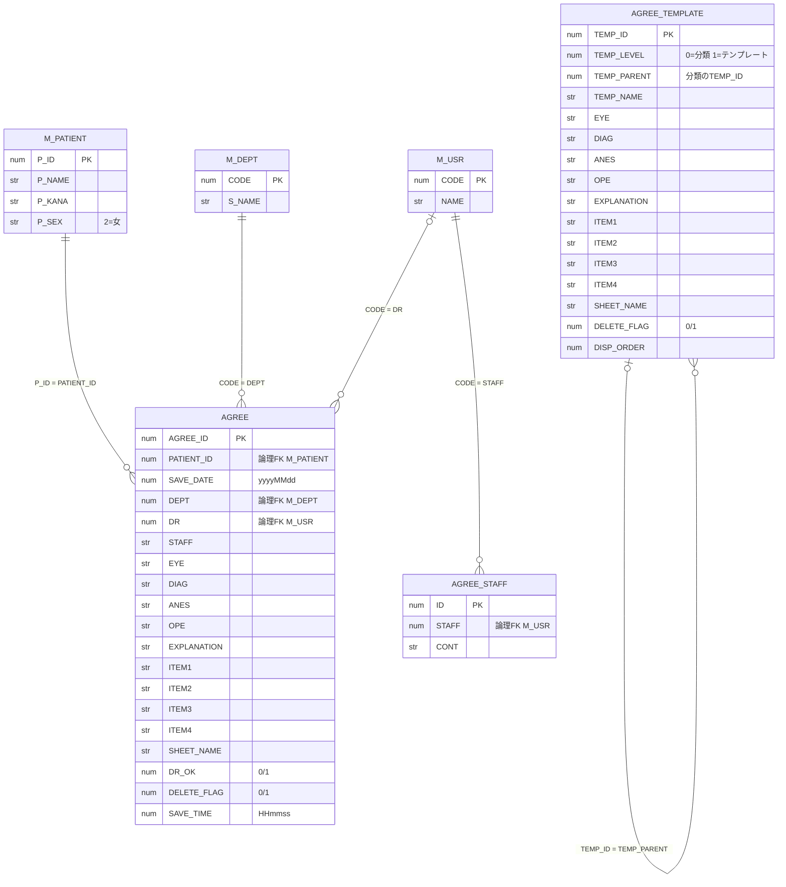

# データモデル（ER 図・テーブル定義）

> **本書の出どころ**
> - `AGREE` / `AGREE_TEMPLATE` / `AGREE_STAFF` の型・桁数・NULL 制約は**本番DBの実測値**
>   （`docs/schema_open.txt`。`DumpSchema` で `ALL_TAB_COLUMNS` を取得。院内情報のため git 管理外）。
>   ただし取得できるのは列定義だけで、**主キー・索引・DEFAULT・チェック制約は未実測**。
> - 電子カルテ側マスタ（`M_PATIENT` / `M_DEPT` / `M_USR`）は**未実測**。DBリンク越しの取得に
>   失敗している（[../dump_schema_production.md](../dump_schema_production.md) 4章）。型・桁数は不明のまま。
> - 参照関係は、SQL の WHERE・JOIN 条件とシーケンスの使い方からの推定。DB 上の外部キー制約が
>   あるかはわからない。
> - テスト用 DDL は [../test_db_schema.sql](../test_db_schema.sql)（上記3表は実測どおり、`M_xxx` は推測）。
>
> **桁数の読み方**：`VARCHAR2` はすべて **BYTE セマンティクス**。全角で何文字入るかは
> DBキャラクタセット次第（JA16SJIS なら byte 数 ÷ 2、AL32UTF8 なら ÷ 3）。本番の
> `NLS_CHARACTERSET` は未確認。

## 1. テーブルの分類

| 区分 | テーブル | 所有 | 参照方法 | アプリの操作 |
| --- | --- | --- | --- | --- |
| トランザクション | `AGREE` | アプリ | スキーマ直下 | 登録・更新・論理削除 |
| アプリ用マスタ | `AGREE_TEMPLATE` | アプリ | スキーマ直下 | 登録・更新・論理削除・並び替え |
| アプリ用マスタ | `AGREE_STAFF` | アプリ | スキーマ直下 | 登録・更新・物理削除 |
| 外部マスタ | `M_PATIENT` | 電子カルテ | `テーブル名 + Env.DB_LINK` | 参照のみ |
| 外部マスタ | `M_DEPT` | 電子カルテ | `テーブル名 + Env.DB_LINK` | 参照のみ |
| 外部マスタ | `M_USR` | 電子カルテ | `テーブル名 + Env.DB_LINK` | 参照のみ |

シーケンス：`AGREE_SEQ`、`AGREE_TEMPLATE_SEQ`、`AGREE_STAFF_SEQ`（INSERT 時の `nextval` と、CSV インポート後の再同期で使う）。

## 2. ER 図

型の `num` / `str` は、コードが値を数値として連結しているか、文字列リテラル（`AgreeSql.SqlValue`）にしているかを表す。DB 上の型ではない。

図にはアプリが読み書きしない本番の予備列（`AGREE.RESERVE1`〜`4`・`AGREE.SAVE_STAFF`・`AGREE_TEMPLATE.RESERVER1`〜`3`）を載せていない。3 章に記載する。

**関係についての補足**

- 同意書側のテーブルと電子カルテのマスタは SQL では JOIN せず、`Ehr.JoinName` で名称列を C# 側で付ける（別の DB に置けるようにするため）。結果は以下の結合と同じ。
- `AGREE` → `M_DEPT` は一覧取得で **INNER JOIN** 相当。`M_DEPT` に無い診療科コードの同意書は、一覧に出ない。診療科名は起動時に読んだ一覧から付ける。
- `AGREE` → `M_USR` は **LEFT JOIN** 相当。職員マスタに無い入力者（Pat.csv 由来のコードなど）でも一覧に出る（氏名は空）。
- `AGREE_STAFF` → `M_USR` は `TmpStaff` の一覧で **INNER JOIN** 相当。`M_USR` に無い `STAFF` の行は一覧に出ない。
- `AGREE_TEMPLATE` と `AGREE` の間に参照関係は無い。テンプレートの値は `Form1.applyTemplate` で画面に**コピー（追記）**され、そのあと `AGREE` に保存される。
- `AGREE_STAFF.STAFF` は 1 医師 1 行を想定している（`Form1.getStaffRoom` は `ExecuteScalar` で先頭行だけ使う）。一意制約があるかは不明。

## 3. テーブル定義

アプリが読み書きする 3 表は、列・型・NULL 制約・列順とも本番の実測値。`VARCHAR2` の桁数は BYTE。

### 3.1 AGREE（同意書）

| 物理名 | 論理名 | 型（本番DB） | NULL | キー | 値の出どころ・ルール | 参照箇所 |
| --- | --- | --- | --- | --- | --- | --- |
| `AGREE_ID` | 同意書 ID | `NUMBER` | NOT NULL | PK（推定） | `AGREE_SEQ.nextval` | `Form1.regAgree` |
| `PATIENT_ID` | 患者 ID | `NUMBER(9,0)` | NOT NULL | 論理 FK | 画面の患者 ID（整数チェック済み）。UPDATE では変更しない | `Form1.regAgree` / `showList` |
| `DEPT` | 診療科コード | `NUMBER(3,0)` | NOT NULL | 論理 FK | 1〜20 の範囲だけ受け付ける（`tryParseDeptCode`） | `Form1.regAgree` |
| `DR` | 入力者（医師）コード | `NUMBER(5,0)` | NOT NULL | 論理 FK | 画面の入力者 ID（整数チェック済み） | `Form1.regAgree` |
| `STAFF` | 担当者 | `VARCHAR2(60)` | | | 自由記述。`AGREE_STAFF.CONT` から自動で入ることがある | `Form1.getStaffRoom` |
| `EYE` | 眼 | `VARCHAR2(20)` | | | 候補：右 / 左 / 両（自由入力も可） | |
| `DIAG` | 病名 | `VARCHAR2(100)` | | | 自由記述 | |
| `OPE` | 手術・検査名 | `VARCHAR2(100)` | | | 自由記述 | |
| `EXPLANATION` | 説明 | `VARCHAR2(1200)` | | | 自由記述 | |
| `ITEM1` | 症状 | `VARCHAR2(200)` | | | 自由記述 | |
| `ITEM2` | 治療計画 | `VARCHAR2(200)` | | | 自由記述 | |
| `ITEM3` | 検査内容 | `VARCHAR2(200)` | | | 画面では非表示。保存・テンプレート差し込みはされるが、**印刷には出力しない** | `Form1.Designer.cs` |
| `ITEM4` | 手術内容 | `VARCHAR2(500)` | | | 自由記述 | |
| `RESERVE1`〜`RESERVE4` | 予備 | `VARCHAR2(200)` | | | **アプリは読み書きしない** | |
| `SHEET_NAME` | 帳票シート名 | `VARCHAR2(50)` | | | 候補：通常 / 短期滞在 / 注射 / 検査同意書 | `ExcelControl.resolveSheetName` |
| `DR_OK` | 医師完了フラグ | `NUMBER(1,0)` | | | 1/0。新規・コピーでは 1。1 のとき登録後に印刷を促す | `Form1.regAgreeButton_Click` |
| `DELETE_FLAG` | 削除フラグ | `NUMBER(1,0)` | | | INSERT で 0、削除で 1（論理削除）。一覧は 0 だけ | `Form1.delAgree` |
| `SAVE_STAFF` | 保存者 | `NUMBER(5,0)` | | | **アプリは読み書きしない**（入力者は `DR` に入れている） | |
| `SAVE_DATE` | 作成日 | `NUMBER(8,0)` | NOT NULL | | 日付ピッカーの値を `yyyyMMdd` | `Form1.regAgree` |
| `SAVE_TIME` | 保存時刻 | `NUMBER(6,0)` | NOT NULL | | 登録時刻 `HHmmss`（INSERT・UPDATE とも更新） | `Form1.regAgree` |
| `ANES` | 麻酔の形式 | `VARCHAR2(100)` | | | 自由記述 | |

### 3.2 AGREE_TEMPLATE（同意書テンプレート）

分類（`TEMP_LEVEL = 0`）とテンプレート（`TEMP_LEVEL = 1`）の 2 階層ツリー。

| 物理名 | 論理名 | 型（本番DB） | NULL | キー | 値の出どころ・ルール | 参照箇所 |
| --- | --- | --- | --- | --- | --- | --- |
| `TEMP_ID` | テンプレート ID | `NUMBER` | NOT NULL | PK（推定） | `AGREE_TEMPLATE_SEQ.nextval` | `TmpAgree.regAgreeTemplate` |
| `TEMP_LEVEL` | 階層 | `NUMBER(1,0)` | NOT NULL | | 0 = 分類、1 = テンプレート | |
| `TEMP_PARENT` | 親 ID | `NUMBER` | NOT NULL | 自己参照 | 分類は 0、テンプレートは分類の `TEMP_ID` | |
| `TEMP_NAME` | 名称 | `VARCHAR2(40)` | NOT NULL | | 必須（画面でチェック）。分類名は重複不可（画面でチェック） | |
| `EYE` / `DIAG` / `OPE` | 各項目 | `VARCHAR2(20)` / `(100)` / `(100)` | | | `AGREE` の同名列と同じ意味。分類行では NULL | |
| `EXPLANATION` | 説明 | `VARCHAR2(1200)` | | | 同上 | |
| `ITEM1`〜`ITEM3` / `ITEM4` | 各項目 | `VARCHAR2(200)` / `(500)` | | | 同上 | |
| `RESERVER1`〜`RESERVER3` | 予備 | `VARCHAR2(200)` | | | **アプリは読み書きしない**（`AGREE` 側の `RESERVE` と綴りが違う） | |
| `DISP_ORDER` | 表示順 | `NUMBER(2,0)` | | | 並び替えのとき、兄弟ノードに 0 から振り直す。INSERT では設定しない（NULL）。**0〜99 まで**なので兄弟が 100 個を超えると入らない | `TmpAgree.moveNode` |
| `SHEET_NAME` | 帳票シート名 | `VARCHAR2(50)` | | | 同上 | |
| `DELETE_FLAG` | 削除フラグ | `NUMBER(1,0)` | | | INSERT で 0、削除で 1。子テンプレートのある分類は削除不可 | `TmpAgree.delAgreeTemplate` |
| `ANES` | 麻酔の形式 | `VARCHAR2(100)` | | | 同上 | |

### 3.3 AGREE_STAFF（担当者文例）

| 物理名 | 論理名 | 型（本番DB） | NULL | キー | 値の出どころ・ルール | 参照箇所 |
| --- | --- | --- | --- | --- | --- | --- |
| `ID` | ID | `NUMBER` | NOT NULL | PK（推定） | `AGREE_STAFF_SEQ.nextval` | `TmpStaff.saveButton_Click` |
| `STAFF` | 入力者（医師）コード | `NUMBER(5,0)` | NOT NULL | 論理 FK | `M_USR` に存在するコードだけ入力できる（画面でチェック） | `TmpStaff.staff_id_Leave` |
| `CONT` | 担当者文例 | `VARCHAR2(60)` | | | 前後の空白を除いて保存。`AGREE.STAFF` の初期値になる | `Form1.getStaffRoom` |

### 3.4 外部マスタ（参照する列だけ）

本番の定義は**未取得**（型・桁数・NULL 制約は不明）。取得手順は [../dump_schema_production.md](../dump_schema_production.md) 4章。

| テーブル | 列 | 論理名 | 用途 | 参照箇所 |
| --- | --- | --- | --- | --- |
| `M_PATIENT` | `P_ID` | 患者 ID | 検索キー | `Form1.showList` |
| | `P_NAME` / `P_KANA` | 氏名 / カナ | 画面表示・印刷 | 〃 |
| | `P_SEX` | 性別 | `2` → 女、それ以外 → 男 | 〃 |
| `M_DEPT` | `CODE` | 診療科コード | コンボの値・結合キー（`0` はコンボに出さない） | `Form1` コンストラクタ / `showList` |
| | `S_NAME` | 診療科略称 | 表示・印刷（`Trim` して使う） | 〃 |
| `M_USR` | `CODE` | 職員コード | 入力者の存在チェック・結合キー | `Ehr.StaffName` / `showList` / `TmpStaff.initList` |
| | `NAME` | 職員氏名 | 表示・印刷（`Trim` して使う） | 〃 |

> [../test_db_schema.sql](../test_db_schema.sql) には `M_DR`・`M_SYOZOKU`・`M_SHIKAKU`・`M_SHINKU`・`M_SEKOU` もある。
> 現在の Agree のコードはこれらを参照していない（以前の `Dict.InitDict` 用の名残と思われる）。

### 3.5 画面の入力上限と列の桁数

`TextBox.MaxLength` は**文字数**、DB の桁数は**バイト数**なので、同じ数値でも全角入力では
列に収まらない。JA16SJIS（全角 2 バイト）を仮定した場合の対応は次のとおり。

| 列 | 桁数(byte) | 全角で入る数 | `MaxLength`（Form1 / TmpAgree / TmpStaff） | 判定 |
| --- | --- | --- | --- | --- |
| `STAFF` | 60 | 30 | 120 | 超過 |
| `EYE` | 20 | 10 | 40 | 超過 |
| `DIAG` / `OPE` / `ANES` | 100 | 50 | 200 | 超過 |
| `EXPLANATION` | 1200 | 600 | 1200 | 超過 |
| `ITEM1`〜`ITEM3` | 200 | 100 | 200 | 超過 |
| `ITEM4` | 500 | 250 | 500 | 超過 |
| `SHEET_NAME` | 50 | 25 | 50 / 100 | 超過（実際は固定候補のみ） |
| `TEMP_NAME` | 40 | 20 | 20 | 収まる |
| `CONT` | 60 | 30 | 30 | 収まる |

`TEMP_NAME` と `CONT` だけが「バイト数の半分」で制限されている。それ以外の自由記述欄は
全角で上限まで入力すると保存時に `ORA-12899` になりうる（未検証）。

## 4. コード値

| 項目 | 値 | 意味 |
| --- | --- | --- |
| `AGREE.DELETE_FLAG` / `AGREE_TEMPLATE.DELETE_FLAG` | 0 / 1 | 有効 / 削除済み |
| `AGREE.DR_OK` | 0 / 1 | 未完了 / 医師完了 |
| `AGREE_TEMPLATE.TEMP_LEVEL` | 0 / 1 | 分類 / テンプレート |
| `M_PATIENT.P_SEX`、Pat.csv の性別 | 1 / 2 | 男 / 女（`M_PATIENT` は 2 以外を男、Pat.csv は 1・2 以外を空として扱う） |
| `SHEET_NAME` | 通常・短期滞在・注射・検査同意書（ほかに「入院」「日帰り」は「通常」扱い） | 帳票テンプレートのシート名 |
