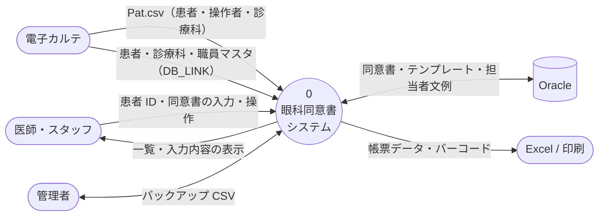
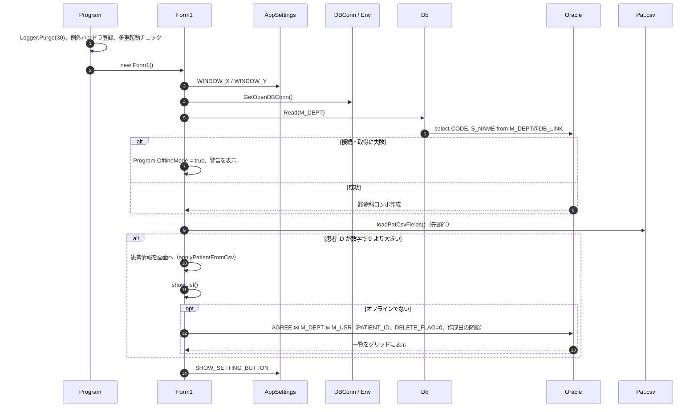
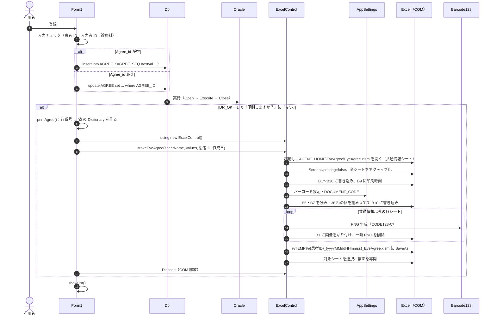
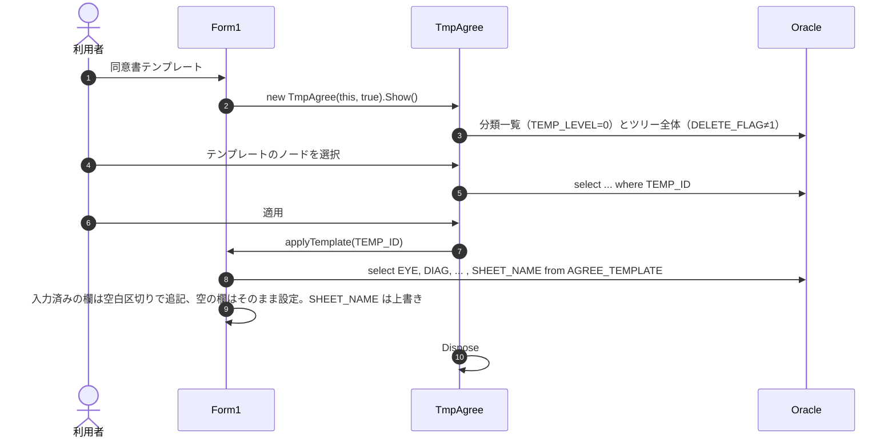
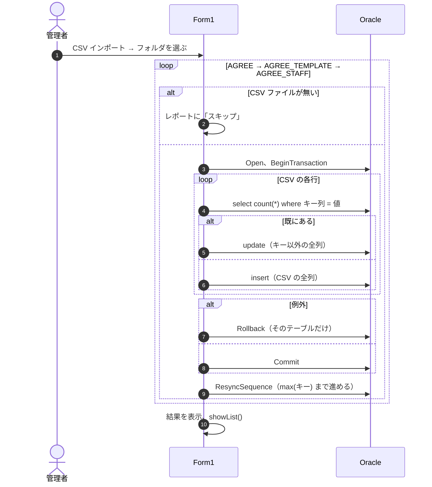

# データフロー図・シーケンス図・入出力マッピング

データがどこから来て、どこへ保存・出力されるかを図と表で示す。
各ステップを文章で詳しく知りたいときは [../dataflow.md](../dataflow.md) を参照。

## 1. コンテキスト図（DFD レベル 0）

## 2. レベル 1 DFD

```mermaid
flowchart TB
    User(["利用者"])
    Admin(["管理者"])
    ExcelApp(["Excel"])

    PatCsv[/"D1 Pat.csv"/]
    Masters[("D2 外部マスタ<br/>M_PATIENT / M_DEPT / M_USR")]
    Agree[("D3 AGREE")]
    Tmpl[("D4 AGREE_TEMPLATE")]
    Staff[("D5 AGREE_STAFF")]
    Settings[/"D6 EyeAgreeSettings.ini"/]
    XlsmT[/"D7 EyeAgree.xlsm（テンプレート）"/]
    XlsmO[/"D8 %TEMP%\出力 xlsm"/]
    Csv[/"D9 バックアップ CSV"/]

    P1(("1<br/>患者情報の<br/>取得"))
    P2(("2<br/>同意書の<br/>検索・表示"))
    P3(("3<br/>同意書の<br/>入力・登録"))
    P4(("4<br/>テンプレート<br/>管理・適用"))
    P5(("5<br/>担当者文例<br/>管理"))
    P6(("6<br/>帳票生成"))
    P7(("7<br/>CSV<br/>入出力"))

    PatCsv -->|"患者 ID・氏名・カナ・性別"| P1
    Masters -->|"氏名・カナ・性別（手入力の別患者）"| P1
    User -->|"患者 ID"| P1
    P1 -->|"患者 ID・患者情報"| P2

    Agree -->|"同意書一覧"| P2
    Masters -->|"診療科略称・入力者氏名"| P2
    P2 -->|"一覧・選択した同意書"| User
    P2 -->|"選択した同意書"| P3

    PatCsv -->|"入力者 ID・氏名・診療科コード"| P3
    Masters -->|"入力者の存在確認・氏名"| P3
    Staff -->|"担当者文例"| P3
    User -->|"入力内容"| P3
    P3 -->|"INSERT / UPDATE / 論理削除"| Agree

    Tmpl -->|"テンプレート内容"| P4
    User -->|"テンプレート編集"| P4
    P4 -->|"登録・並び替え・論理削除"| Tmpl
    P4 -->|"差し込む値"| P3

    User -->|"文例の編集"| P5
    Masters -->|"職員氏名"| P5
    P5 -->|"登録・物理削除"| Staff

    P3 -->|"画面の入力値（行番号 → 値）"| P6
    Settings -->|"文書コード・バーコード解像度"| P6
    XlsmT -->|"帳票テンプレート"| P6
    P6 -->|"値・バーコード画像"| XlsmO
    XlsmO --> ExcelApp

    Agree & Tmpl & Staff -->|"全行"| P7
    P7 -->|"CSV 出力"| Csv
    Csv -->|"CSV 取り込み"| P7
    P7 -->|"マージ（UPDATE / INSERT）"| Agree & Tmpl & Staff
    Admin -->|"フォルダ指定"| P7
```

## 3. シーケンス図

### 3.1 起動 → 患者の同意書一覧を表示

### 3.2 登録 → 印刷（Excel 帳票生成）

### 3.3 テンプレートの適用

### 3.4 CSV インポート

テーブルごとにコミットするため、途中のテーブルで失敗すると、それより前のテーブルは取り込み済みのまま残る。

## 4. 入出力マッピング

### 4.1 Pat.csv → 画面

`Env.LEGACY_HOME\Pat.csv` の**先頭行**をカンマで分割する（エンコーディングは `Encoding.Default`、引用符は扱わない）。

| CSV 位置（0 始まり） | 内部項目 `PatCsvFields` | 画面項目 | 変換・条件 |
| --- | --- | --- | --- |
| [2] | `PtId` | 患者 ID | 整数でなければ読込全体をスキップ |
| [3] | `PtName` | 氏名 | そのまま |
| [5] | `PtKana` | カナ | そのまま |
| [6] | `PtSex` | 性別 | 1 → 男、2 → 女、それ以外 → 空 |
| [9] | `DrId` | 入力者 ID | 新規作成で [27] = "1" のとき `int.Parse`。コピーでは整数のときだけ |
| [10] | `DrName` | 入力者氏名 | 同上 |
| [13] | `DeptCode` | 診療科 | 新規作成で [27] = "1"、1〜20 の整数、[14] が空でない、`M_DEPT` にある、のすべてを満たすとき |
| [14] | `Field14` | — | 用途不明。診療科を反映するかの判定だけに使う |
| [27] | `Field27` | — | 用途不明。"1" のとき医師情報を反映する |

### 4.2 画面 → AGREE（登録）

| 画面項目 | コントロール | AGREE 列 | 変換・バリデーション |
| --- | --- | --- | --- |
| 番号 | `Agree_id` | `AGREE_ID` | 空なら INSERT（`AGREE_SEQ.nextval`）、整数なら UPDATE のキー |
| 患者 ID | `pt_id` | `PATIENT_ID` | 必須・整数。INSERT のときだけ設定 |
| 作成日 | `save_date` | `SAVE_DATE` | `yyyyMMdd` |
| 診療科 | `dept` | `DEPT` | 必須。「コード 科名」の前半で、1〜20 |
| 入力者 | `dr_id` | `DR` | 必須・整数 |
| 担当者 | `staff` | `STAFF` | `AgreeSql.SqlValue`（空は NULL、`'` をエスケープ） |
| 眼 | `eye` | `EYE` | 同上 |
| 病名 | `diag` | `DIAG` | 同上 |
| 麻酔の形式 | `anes` | `ANES` | 同上 |
| 手術・検査名 | `ope` | `OPE` | 同上 |
| 説明 | `explanation` | `EXPLANATION` | 同上 |
| 症状 | `item1` | `ITEM1` | 同上 |
| 治療計画 | `item2` | `ITEM2` | 同上 |
| 検査内容（非表示） | `item3` | `ITEM3` | 同上 |
| 手術内容 | `item4` | `ITEM4` | 同上 |
| シート | `sheetName` | `SHEET_NAME` | 同上 |
| （内部） | `doctorConfirmed` | `DR_OK` | true → 1、false → 0 |
| （内部） | — | `DELETE_FLAG` | INSERT のとき 0 |
| （内部） | — | `SAVE_TIME` | 登録時刻 `HHmmss` |

### 4.3 画面 → Excel「共通情報」シート（印刷）

すべて B 列に書き込む。テンプレートの各帳票シートは、このシートのセルを参照する前提（xlsm 側の数式はコードからは確認できない）。

| セル | 内容 | 出どころ | 変換 |
| --- | --- | --- | --- |
| B1 | 患者 ID | `pt_id` | Trim |
| B2 | 患者カナ | `pt_kana` | |
| B3 | 患者氏名 | `pt_name` | |
| B4 | 性別 | `pt_sex` | 「男」「女」 |
| B5 | 診療科コード | `dept` の前半 | |
| B6 | 診療科名 | `dept` の後半 | |
| B7 | 入力者 ID | `dr_id`（一覧で選んだ行なら DB の `AGREE.DR`） | 5 桁にゼロ埋め |
| B8 | 作成日 | `save_date` | `yyyyMMdd` |
| B9 | 印刷時刻 | `DateTime.Now` | `HHmmss`（`ExcelControl` が書く） |
| B10 | バーコード値 | 下の表 | 36 桁（`ExcelControl` が書く） |
| B11 | 入力者氏名 | `dr_name` | Trim |
| B12 | 担当者 | `staff` | |
| B13 | 眼 | `eye` | |
| B14 | 手術名 | `ope` | |
| B15 | 麻酔 | `anes` | |
| B16 | 病名 | `diag` | |
| B17 | 説明 | `explanation` | |
| B18 | 症状 | `item1` | |
| B19 | 治療計画 | `item2` | |
| B20 | 手術内容 | `item4` | `item3`（検査内容）は出力しない |
| 各帳票シートの D1 | バーコード画像 | B10 の値 | CODE128-C の PNG（250×30pt）。36 桁の数字でなければ貼らない |

**バーコード値（36 桁）の構成**（`ExcelControl.buildBarcodeValue`）

| 順 | 桁数 | 内容 | 出どころ |
| --- | --- | --- | --- |
| 1 | 9 | 患者 ID | 引数（ゼロ埋め） |
| 2 | 5 | 文書コード | `DOCUMENT_CODE`（既定 39911、ゼロ埋め） |
| 3 | 3 | 診療科コード | B5（ゼロ埋め） |
| 4 | 5 | 入力者 ID | B7（ゼロ埋め） |
| 5 | 8 | 作成日 | 引数 `yyyyMMdd` |
| 6 | 6 | 印刷時刻 | `HHmmss` |

**出力ファイル**：`%TEMP%\{患者ID}_{印刷日 yyyyMMdd}{印刷時刻 HHmmss}_EyeAgree.xlsm`（マクロ有効ブック）。
開いた後に選択するシートは `SHEET_NAME` で、「入院」「日帰り」は「通常」に読み替える。

### 4.4 テーブル ⇔ バックアップ CSV

| 項目 | 仕様 |
| --- | --- |
| ファイル | 選んだフォルダの `AGREE.csv` / `AGREE_TEMPLATE.csv` / `AGREE_STAFF.csv` |
| エクスポート | `select *` の全列。1 行目は列名。値は `ToString()` し、`AgreeSql.CsvEscape` でエスケープ。エンコーディングは `Encoding.Default`。同名ファイルは上書き |
| インポートのキー | `AGREE_ID` / `TEMP_ID` / `ID`（見出し行に無ければ例外） |
| インポートの値 | 全列を `AgreeSql.SqlValue` で文字列リテラルにする（空は NULL）。数値列は Oracle の暗黙変換に任せる |
| 反映方法 | キーが既にあれば、キー以外の全列を UPDATE。無ければ CSV の全列を INSERT |
| 後処理 | シーケンスを `max(キー)` まで進める |
